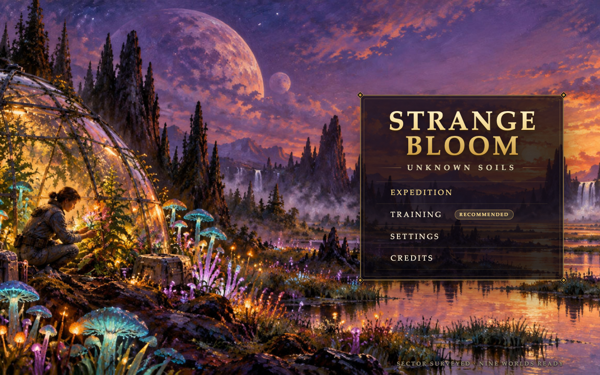
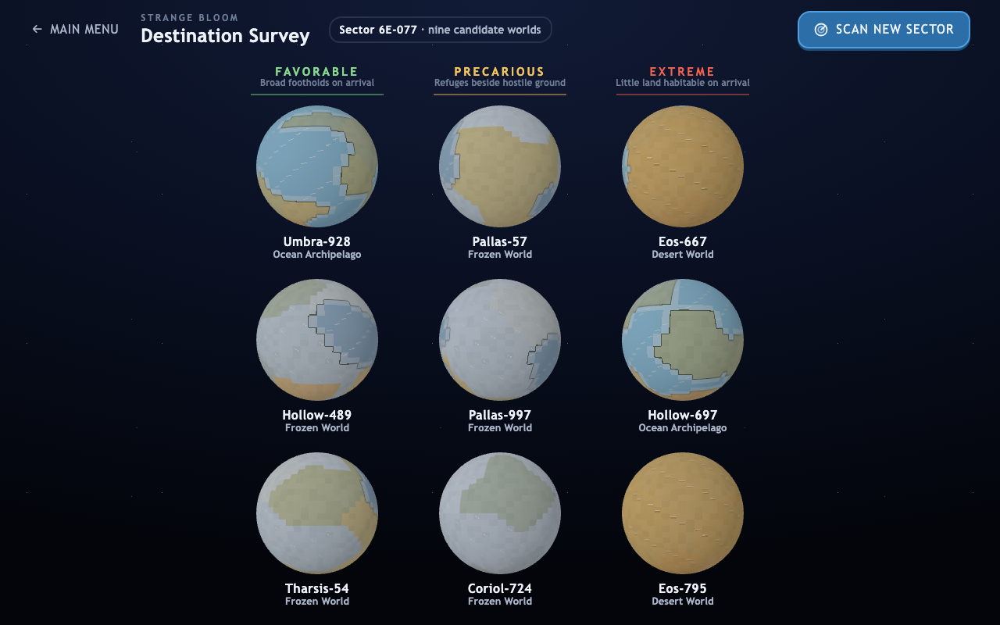
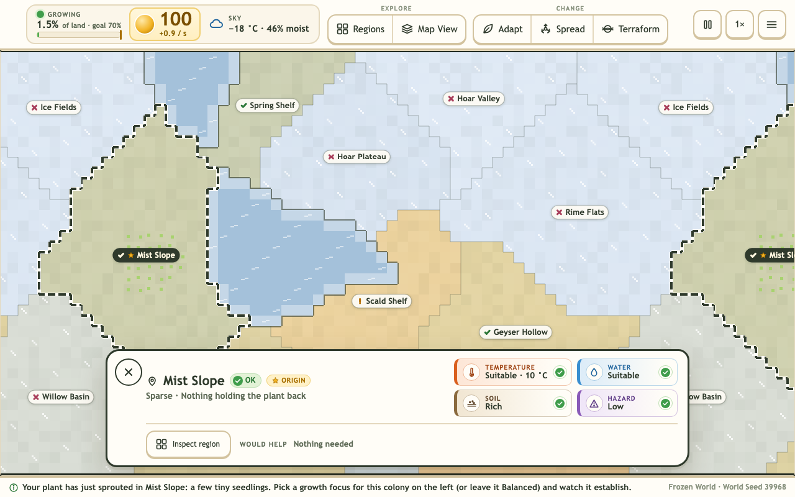
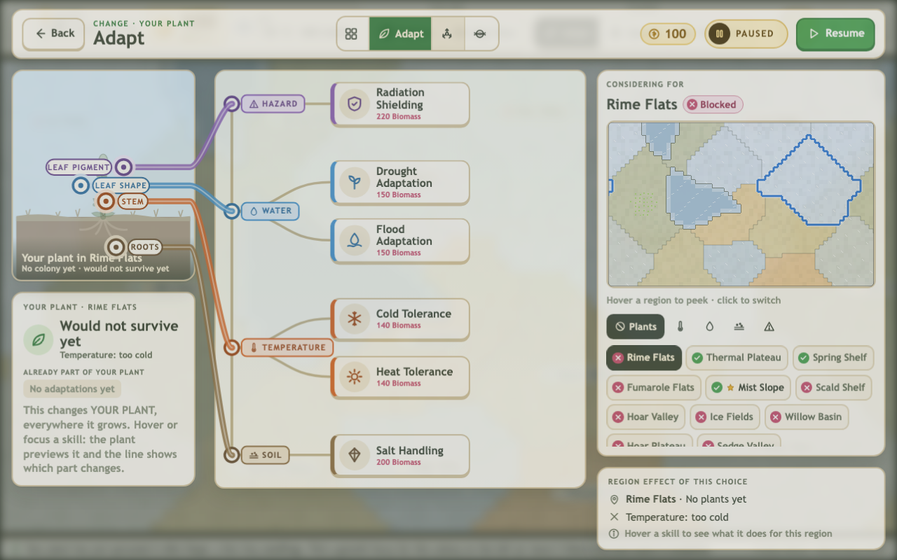
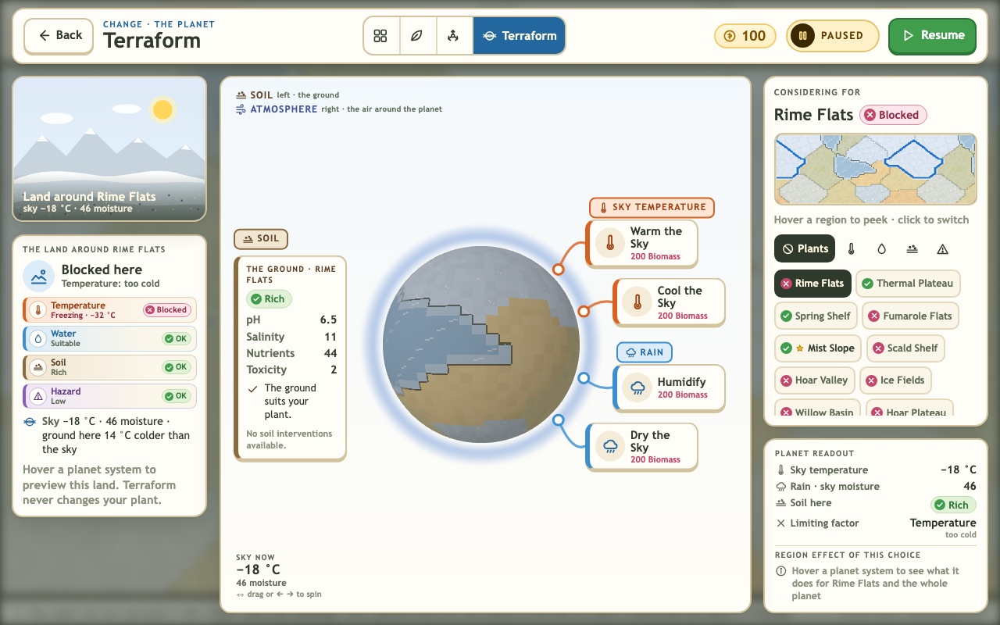

# Strange Bloom · Unknown Soils



**Evolve one plant. Survive a strange world. Make it bloom.**

You land on an unknown planet with a single pioneer plant. Here the ground is frozen solid. Over there it's parched,
salty or scorched by radiation. Your job is to read the land, evolve a plant that can live on it, or reshape the sky itself, and spread
until most of the world is alive at once.

Strange Bloom is a strategy game about adaptation that you play in your browser, in the spirit of *Plague Inc.*, except
you're the one bringing a planet to life. There's nothing to install and no account to make.

---

## Choose your world



Choose **Expedition** on the title screen and every expedition begins at the **Destination Survey**: a sector of nine planets, each one a real globe you can spin and
study before you commit. They're sorted by how much of the land your plant could live on the moment it lands:

- **Favorable**: broad footholds on arrival.
- **Precarious**: refuges beside hostile ground.
- **Extreme**: little land you can live on at first. Every inch is earned.

That choice *is* the difficulty: there's no separate easy / normal / hard setting.

Each world is generated fresh and **proven winnable before it's offered**. Pick one and you descend through the clouds onto
exactly the planet you chose. Don't like this sector? Scan a new one.

| | The problem to solve |
|---|---|
| **Ocean Archipelago** | No single island is big enough to win, so your plant has to learn to cross open water. |
| **Desert World** | Water. Wet basins are your refuges, so either evolve to live dry or make it rain. |
| **Frozen World** | Cold. Geothermal pockets keep you alive. Evolve for the ice, or warm the whole sky and risk cooking your refuges. |

## Read the land



Every region on the map tells you whether your plant can live there, and if it can't, **exactly why**. Each region is graded on
four conditions:

**Temperature · Water · Soil · Hazard**

The worst of the four is the region's **limiting factor**: *too cold*, *too dry*, *too salty*. Find it and fix it, and the region
opens up. Your plant spreads on its own into any ground it can survive. Living colonies earn **Biomass**, the energy you spend on
everything else.

## Change the plant, or change the planet



Biomass buys three kinds of upgrade:

- **Adapt** changes *your plant*, everywhere it grows: Cold Tolerance, Drought Adaptation, Salt Handling, Radiation Shielding and
  more. You can see the plant itself change as it evolves.
- **Spread** changes *how it travels*: more seeds, faster growth, the ability to cross water.
- **Terraform** changes *the planet*: warm or cool the sky, add or remove rain. One purchase reshapes every region at once,
  including the ones that were already working for you.



You can also steer individual colonies: pick what each one focuses on, or spend Biomass to strengthen one for good.

Every choice is a tradeoff. Your plant only has so much room for temperature tolerance, so deep cold tolerance leaves none for heat.
Warming a frozen world might open the ice fields and scorch your geothermal refuges. Hover over any upgrade to preview what it
will do, region by region, before you spend anything.

## You don't need every region

You win by keeping **70% of the planet's land alive at the same time**. Some regions are meant to be given up. Winning is
about finding a strategy that suits *this* planet, not buying every upgrade. When you bloom, your **Field Journal** explains why your
strategy worked and which regions you gave up for it. Then you can keep growing toward 100%, play the same planet again with a
different plan, or set out for a new world.

## New to the game?

Choose **Training** on the title screen. It's about five minutes on a gentle practice world: thirteen short guided lessons that
walk you through spreading, collecting Biomass, finding a limiting factor, adapting, terraforming and reading a tradeoff.
You learn by playing, not by reading.

## Learn real science by playing

Strange Bloom was designed alongside middle-school life and earth science. The ideas aren't taught in pop-ups. They're the
rules you need to win:

- **Adaptation and tolerance ranges**: organisms survive where conditions fall inside what they can tolerate.
- **Limiting factors**: growth is held back by the single condition furthest out of range.
- **Tradeoffs**: specializing for one environment costs you in another.
- **Dispersal**: how seeds reach new ground, and why water is a barrier.
- **Planetary feedback**: life changes the atmosphere, and the atmosphere changes where life can grow.

When you win, you should be able to say: *I understood this planet, built the right plant for it, and made it bloom.*

---

## Play it

**On your computer:** download the repository (**Code → Download ZIP**, then unzip it) or clone it, and **double-click
`index.html`**. That's it: no installation, no server, no internet connection needed.

**Online:** once GitHub Pages is switched on for this repository, the game will be playable at
**<https://interstellarharvest.github.io/bloom/>**.

Then choose **Expedition**. The whole game runs in that one page: title, training, the survey, the expedition and its report.

Tested on desktop in Chromium-based browsers and Firefox (Safari hasn't been tested yet). There's no sound, and runs aren't saved between visits.

## For developers

Develop against the source over HTTP (ES modules, module workers), from the repository root:

```sh
python3 -m http.server 8767        # then open http://localhost:8767/
```

A double-clicked copy runs a **generated portable runtime** (`dist/portable/`, built from the same source; never edit it by hand).
After changing a module it contains, rebuild and commit it: `npm --prefix tools ci` once, then `npm --prefix tools run build:portable`
([`docs/PORTABLE_RUNTIME_v1.md`](docs/PORTABLE_RUNTIME_v1.md)). Players never need Node or npm.

The whole game is one application, `index.html`. `demos/demo-run.html` is a developer harness only (direct runs, scenarios, the
historical engineering shell for regression suites); players never see it ([`docs/SINGLE_DOCUMENT_APP_v1.md`](docs/SINGLE_DOCUMENT_APP_v1.md)).

**What's decided and what's next:** [`docs/PRODUCT_DIRECTION_CURRENT.md`](docs/PRODUCT_DIRECTION_CURRENT.md) is the current product-direction
record and roadmap (visual-system convergence, then plant species, then Challenges).

How the game was built, its design, architecture, test suites and release history live in the docs:

- [`docs/PRODUCT_DIRECTION_CURRENT.md`](docs/PRODUCT_DIRECTION_CURRENT.md): **the current product decisions and roadmap** (this wins over
  older documents about the current direction).
- [`GAME_BIBLE.md`](GAME_BIBLE.md): the broad design bible.
- [`docs/SINGLE_DOCUMENT_APP_v1.md`](docs/SINGLE_DOCUMENT_APP_v1.md): the production architecture: one document, GameSession, the developer harness.
- [`docs/RELEASE_CANDIDATE_v1.md`](docs/RELEASE_CANDIDATE_v1.md): the BLOOM-030 release candidate (milestone-era: player flow, developer
  URLs; the pressure mechanics Dying World, Native Competition and Volatile Climate, today developer-harness runs and future Challenge ingredients).
- [`docs/PORTABLE_RUNTIME_v1.md`](docs/PORTABLE_RUNTIME_v1.md): how one game runs from a double-clicked file and from GitHub Pages
  (the portable build, the Pages workflow and its one-time setting).
- [`docs/DEVELOPMENT_NOTES.md`](docs/DEVELOPMENT_NOTES.md): the full development log, QA and architecture notes (formerly this README).

## Credits

Design, worlds, simulation and code by the BLOOM project team. Twelve hand-painted expedition vistas by the project's owner.
Planet globes are drawn with [Three.js](https://threejs.org/) (MIT).
